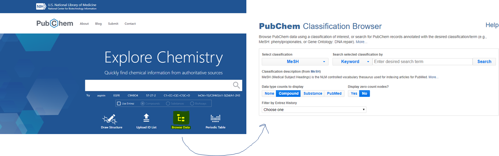
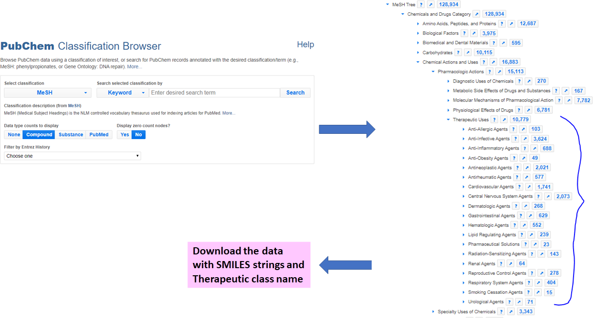

## How to construct the SMILES drug dataset?

Please note that Meyer et al paper provides a broad summary of input data construction. In this tutorial, I have given the details of the process. Please note due to database updates, search results might be different. Please see below for a step-by-step instruction.

PubChem Data Extraction steps:

