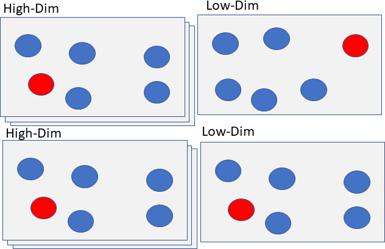

## t-SNE for Dimension Reduction and analysis

*   **t-SNE** stands for **t-**distributed **S**tochastic **N**eighbor **E**mbedding
*   t-SNE belongs to unsupervised learning class of modeling methods and is a non-linear method
*   Like PCA, t-SNE can be used to reduce sample space from higher-dimension to lower-dimension (2/3 dimensions for example) with an approximate goal of preserving the distances between samples 
* PCA (developed in 1933), t-SNE (very recent addition, 2008)
* Unlike t-SNE, PCA tries to identify a 
projected space which the features that maximize the variance (long structure). On the other hand, t-SNE aims to preserve local structure when mapping from high dimensional to low dimensional space

How does t-SNE work? 

A schematic diagram to show the preservation of local structure when mapping from higher dimensional space (left) to a low-dimensional space (ex 2 dim).

Comparison of High-D/Low-D data in t-SNE

Top row is mapping (non t-SNE) from high-dimensional space to low (2D) space. The local structures are not captured whereas t-SNE (second row) does exactly that. 

The following one-liner provides a simple explanation of this difficult topic, 

* t-SNE 
    * compares probabilities (conditional) of similarity of neighboring points in high Dim. space to the low-dim space. t-SNE does this using Kullback-Leibler (KL) divergence.  
    Follow the link for details, http://www.jmlr.org/papers/volume9/vandermaaten08a/vandermaaten08a.pdf

Here are the steps:

* Can use PCA to reduce the dimensionality as the first step (optional)
* Constructs a probability distribution of distance pairs in high dimensional space (original)
* Constructs a probability distribution of distance pairs in low-dimensional space 
* Minimizes the K-L divergence (distance metric) between the two distributions (high & low) using Stochastic Gradient Descent method
